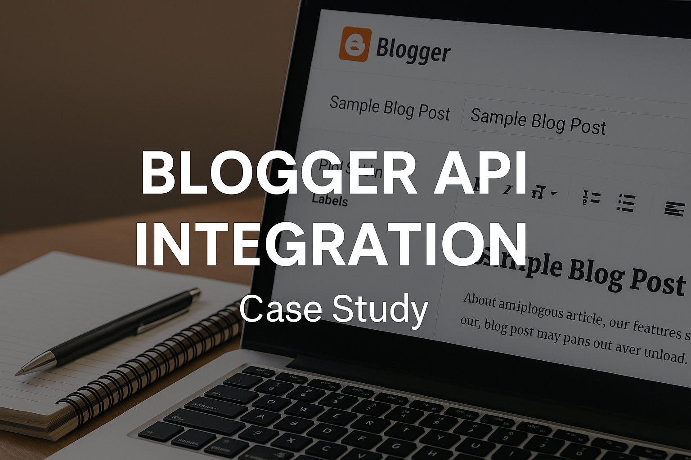

# Blogger AI Automation 🚀

**Author:** ubagyan  
**Tech Stack:** Google Apps Script · Gemini API · Pexels API · Blogger API · Google Sheets

---
## 🔗 Live Demo
Check out a live post generated by this system:  
👉    [howtodays.blogspot.com](https://howtodays.blogspot.com/)

---

## 📖 Overview
This project automates the creation, publishing, and feedback synchronization of blog posts using AI and APIs. It combines the power of Gemini (Google’s Generative AI) with Google Apps Script and Sheets to streamline blogging workflows end-to-end.

---

## ✨ Features

### ✅ AI-Powered Blog Generator
- Generates SEO-optimized HTML blog content using **Gemini API**.
- Embeds structured content using `<h1>`, `<h2>`, `
`, and more.

### ✅ Image Integration
- Uses **Pexels API** to fetch relevant royalty-free images.
- Alt text is AI-generated via Gemini for accessibility and SEO.

### ✅ Blogger Auto-Publishing
- Posts are published directly to Blogger via **Blogger API v3**.
- Titles, content, labels, and URLs are synced to the Google Sheet.

### ✅ Comments & Metadata Sync
- Automatically pulls all posts and comments into Sheets.
- Useful for engagement tracking, moderation, and archiving.

---

## 📊 Sheet Layout

### `Sheet1`
| Column | Description                          |
|--------|--------------------------------------|
| A      | Keyword or Suggested Blog Title      |
| B      | AI-generated HTML Content            |
| C      | SEO Tags (comma-separated)           |
| D      | Status: `Generate`, `Draft`, `Published` |
| E      | Published Blog URL                   |

### `Posts` Tab
Stores post metadata: ID, title, labels, dates, content.

### `Comments` Tab
Stores reader comments: author, content, timestamp.

---

## ⚙️ Technologies Used
- **Google Apps Script**: Orchestrates the automation
- **Gemini API**: AI blog content & alt-text generation
- **Pexels API**: Fetches contextual stock images
- **Blogger API**: Publishes posts and retrieves metadata
- **Google Sheets**: UI & database

---

## 🚀 How to Run
1. Open your **Google Sheet**.
2. Go to **Extensions → Apps Script** and paste the code.
3. Use the `Blog Automation` menu:
   - Set API Keys
   - Generate Blog Drafts
   - Publish to Blogger
   - Sync Posts & Comments
4. Fill Column A with blog topics and set Column D to `Generate`.

---

## 🧠 Skills Demonstrated
- AI Prompt Engineering
- Google Apps Script Development
- REST API Authentication & Integration
- Automation Workflow Design
- Content SEO Optimization

---

## 📬 Contact
**ubagyan**  
[LinkedIn](https://www.linkedin.com/in/han-htet-s-185a9b2ab/) | [GitHub](https://github.com/ubagyan)

---

## 🪪 License
MIT License – Free to use and modify for personal or commercial projects.
